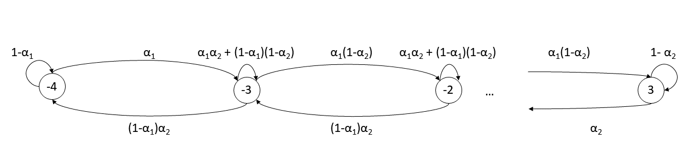

# Assignment 01 - Discrete Time Markov Chains

## Problem Statement

A manufacturing setup consists of two distinct machines, each producing one component per hour. Each component is tested instantly and is identified as defective or non-defective. Let &alpha;<sub>i</sub> be the probability that a component produced by machine i is non-defective, for i = 1; 2. The defective components are discarded and the non-defective components are stored in two different bins, one for each machine. When a component is present in each bin, the two are instantly assembled together and shipped out. Bin i can hold at most Bi components (where Bi is a fixed positive integer) for i = 1; 2. When a bin is full, the corresponding machine is turned off. It is turned on again when the bin has space for at least one component. Assume that successive components are independent. Model the system as a DTMC by writing down the state Xn, state space S and drawing the transition diagram. Write a program to obtain the steady-state probabilities. For the numerical values (we call these the baseline values) B1 = 3, B2 = 4, &alpha;<sub>1</sub> = 0.7 and &alpha;<sub>2</sub> = 0.6, obtain (a) the long-run average number of components in each buffer at the beginning of an hour (before any production) and (b) the throughput (the steady-state number of assembled products shipped
out per hour). Perform four numerical experiments by varying one of B1, B2, &alpha;<sub>1</sub> and &alpha;<sub>2</sub> while leaving the others at their baseline values described above. For example, you can vary B1 from 1 to 10 with B2 = 4, &alpha;<sub>1</sub> = 0.7 and &alpha;<sub>2</sub> = 0.6. Likewise, you could vary &alpha;<sub>2</sub> from 0.1 to 0.9 while keeping B1, B2 and alpha;<sub>1</sub> at the baseline values. Graph (a) and (b), what do you observe? Explain your findings.


```python
import numpy as np
import matplotlib.pyplot as plt
%matplotlib inline
import pandas as pd
```

## DTMC Modeling

Let X<sub>n</sub> be the number of components in the Bin 1 at the beginning of the n-th hour. If a component is present in both bins, the two are assembled immediately, so at the beginning of an hour, there can be components in only one of the 2 bins. So, let X<sub>n</sub> grow negatively when there are components in Bin 2 instead of Bin 1.

So the state space then becomes, {-B2, -B2+1,…,0, 1, 2,…,B1}

Data for the given problem:


```python
alpha1 = 0.7
alpha2 = 0.6
B1 = 3
B2 = 4
```


```python
parameters = [B1, B2, alpha1, alpha2]
```

Saving the state space as a list.


```python
def getStateSpace(B1,B2):
    return(list(range(-B2,B1+1)))
```


```python
S = getStateSpace(B1,B2)
print("The state space is " + str(S))
```

    The state space is [-4, -3, -2, -1, 0, 1, 2, 3]
    

*Side Note: The reason to express the state space in this way is to make it easier to write code. The edge cases i.e. when the bins are full are at the edge of the state space while all middle states have similar transitions. Also, since the state space is 1-dimensional instead of 2-dimensional, the functions can be of O(n) instead of O(n2)*

So, the transition diagram can be obtained as follows:

Considering edge cases when the bins are full and their corresponding machines are shut.

If X<sub>n</sub> = -B<sub>2,
* X<sub>n+1</sub> = -B<sub>2</sub> wp 1 - &alpha;<sub>1</sub> i.e. a defective component is produced by machine 1 and,
* X<sub>n+1</sub> = -B<sub>2</sub> + 1 wp &alpha;<sub>1</sub> i.e. a non-defective component is produced by machine 1.

All other states are beyond reach in one step.

Similarly,

If X<sub>n</sub> = B<sub>1</sub>,
* X<sub>n+1</sub> = B_1 - 1 wp &alpha;<sub>2</sub> i.e. a non-defective component is produced by machine 2 and, 
* X<sub>n+1</sub> = B<sub>1</sub> wp 1-&alpha;<sub>2</sub> i.e. a defective component is produced by machine 2.

All other states are beyond reach in one step.

For all other values of X<sub>n</sub> in S,
* X<sub>n</sub> = X<sub>n</sub> - 1 wp 1-&alpha;<sub>2</sub> i.e. a defective component is produced by machine 2 and,
* X<sub>n+1</sub> = X<sub>n</sub> wp &alpha;<sub>1</sub>&alpha;<sub>2</sub> + (1-&alpha;<sub>1</sub>)(1-&alpha;<sub>2</sub>) i.e. either both machines produce a defective component or both machines produce a working component
* X<sub>n+1</sub> = X_n + 1 wp &alpha;<sub>2</sub> i.e. a non-defective component is produced by machine 2





```python
def getPMatrix(B1, B2, alpha1, alpha2):
    P = np.zeros([B1+B2+1,B1+B2+1])
    
    # Edge cases
    
    # Filled bin 2
    
    P[0][0] =1-alpha1
    P[0][1] = alpha1
    
    # Filled bin 1
    
    P[B1+B2][B1+B2-1] = alpha2
    P[B1+B2][B1+B2] =1-alpha2

    for i in range(B1+B2-1):
        P[i+1][i] = (1-alpha1)*alpha2
        P[i+1][i+1] = alpha1*alpha2 + (1-alpha1)*(1-alpha2)
        P[i+1][i+2] = alpha1*(1-alpha2)


    
    return(P)
```

For the given problem, the state matrix is:


```python
P = getPMatrix(B1, B2, alpha1, alpha2)
```


```python
P
```


    array([[0.3 , 0.7 , 0.  , 0.  , 0.  , 0.  , 0.  , 0.  ],
           [0.18, 0.54, 0.28, 0.  , 0.  , 0.  , 0.  , 0.  ],
           [0.  , 0.18, 0.54, 0.28, 0.  , 0.  , 0.  , 0.  ],
           [0.  , 0.  , 0.18, 0.54, 0.28, 0.  , 0.  , 0.  ],
           [0.  , 0.  , 0.  , 0.18, 0.54, 0.28, 0.  , 0.  ],
           [0.  , 0.  , 0.  , 0.  , 0.18, 0.54, 0.28, 0.  ],
           [0.  , 0.  , 0.  , 0.  , 0.  , 0.18, 0.54, 0.28],
           [0.  , 0.  , 0.  , 0.  , 0.  , 0.  , 0.6 , 0.4 ]])


## Steady-state DTMC

Since, the DTMC is irreducible and aperiodic, we can solve the following equation to find the steady state probabilities.


Here &piv; is the array of steady state probability of all states.

This can be solved by substituting the last column in [I – P] with 1 and inverting that matrix. The code for this is as below


```python
def getPi(P):
    n = P.shape[0]
    I = np.identity(n)
    Q = I-P
    Q[:,n-1] = 1
    a = np.zeros(n)
    a[-1] = 1
    pi = np.dot(a,np.linalg.inv(Q))
    return(pi.round(4))
```

For the given problem, the steady state probabilities are:


```python
pi = getPi(P)
```


```python
pi
```


    array([0.0091, 0.0354, 0.0551, 0.0858, 0.1334, 0.2076, 0.3229, 0.1507])


## Calculating Components and Throughput

### Components in Bins

Let Y<sub>i</sub> be the number of components in Bin i for i = 1,2. The average number of components at the beginning of an hour is then given by E[Y<sub>i</sub>].


Here,
* P(X<sub>n</sub> = j) = &piv;<sub>j</sub> where j &isin; S
* E[Y<sub>1</sub> | X<sub>n</sub> = j] = j where j &isin; {0, 1,2,…,B_1}
* E[Y<sub>2</sub> | X<sub>n</sub> = j] = -j  where j &isin; {-B_2,-B_2+1,…,-1, 0}


```python
def getBinComponents(bin_num, parameters):
    B1, B2, alpha1, alpha2 = parameters
    P = getPMatrix(B1, B2, alpha1, alpha2)
    pi = getPi(P)
    if bin_num == 1:
        j = np.array(range(B1+1))
        comps = np.sum(j*pi[B2:])
    else:
        j = np.array(range(B2+1))
        comps = np.sum(j*pi[B2::-1])
    return(round(comps,4))
```

For the given problem,


```python
getBinComponents(1, parameters)
```


    1.3055


```python
getBinComponents(2, parameters)
```


    0.3386


### Throughput

Let Z be the number of assembled products in an hour. The average number of products assembled is then given by E[Z].


Here,
* P(X<sub>n</sub> = j) = &piv;<sub>j</sub> where j &isin; S
* E[Z | X<sub>n</sub> = j] = &alpha;<sub>2</sub> where j &isin; {1,2,…,B_1}
* E[Z | X<sub>n</sub> = j] = &alpha;<sub>1</sub>  where j &isin; {-B_2,-B_2+1,…,-1}
* E[Z | X<sub>n</sub> = j] = &alpha;<sub>1</sub>&alpha;<sub>2</sub> where j = 0


```python
def getItems(parameters):
    B1, B2, alpha1, alpha2 = parameters
    P = getPMatrix(B1, B2, alpha1, alpha2)
    pi = getPi(P)
    expZ = np.zeros(B1+B2+1)
    expZ[:B2] = alpha1
    expZ[B2] = alpha1*alpha2
    expZ[B2+1:] = alpha2
    items = np.sum(expZ*pi)
    return(items)
```

For the given problem,


```python
getItems(parameters)
```


    0.594528


## Experiments

### Defining Functions to draw graphs


```python
plt.rcParams['figure.figsize'] = (12.0, 8.0)
plt.rcParams.update({'font.size': 16})
```


```python
def draw_components(x, xname, Bin1Comp, Bin2Comp):
    plt.plot(x, Bin1Comp, 'r^', label = 'Bin 1')
    plt.plot(x, Bin2Comp, 'bx', label = 'Bin 2')
    plt.legend(loc="upper left")
    plt.ylim(0,10)
    plt.ylabel("Average Components")
    plt.xlim(0,max(x)+x[1]-x[0])
    plt.xlabel(xname)
    plt.savefig(xname+'- Components')
    plt.show()
```


```python
def draw_throughput(x, xname, ShippedProds):
    plt.plot(x, ShippedProds, 'go')
    plt.ylim(0,1)
    plt.xlim(0,max(x)+x[1]-x[0])
    plt.ylabel("Average Shipped Products")
    plt.xlabel(xname)
    plt.savefig(xname+'- Throughput')
    plt.show()
```

### Experiment function


```python
def experiment(parameters, change_idx = 0):
    param_copy = parameters[:]
    """
    change_idx is the index of the parameter to change. It takes values from 0 to 3. When 0 the 0th parameter i.e. B1 is
    changed
    """
    xnames = {0: 'Bin 1 Capacity', 
              1: 'Bin 2 Capacity',
              2: 'Machine 1 success rate',
              3: 'Machine 2 success rate'}
    
    Bin1Comp = []
    Bin2Comp = []
    ShippedProds = []
    
    if change_idx == 0 or change_idx == 1:
        param_range = list(range(1,11))
    else:
        param_range = np.arange(0.1, 1.0, 0.1)

    for i in param_range:
        param_copy[change_idx] = i
        Bin1Comp.append(getBinComponents(1, param_copy))
        Bin2Comp.append(getBinComponents(2, param_copy))
        ShippedProds.append(getItems(param_copy))
        
    draw_components(param_range, xnames[change_idx], Bin1Comp, Bin2Comp)
    draw_throughput(param_range, xnames[change_idx], ShippedProds)
```

### Changing Bin 1 Capacity


```python
experiment(parameters, 0)
```


### Changing Bin 2 Capacity


```python
experiment(parameters, 1)
```


### Changing Machine 1 Success Rate


```python
experiment(parameters, 2)
```


### Changing Machine 2 Success Rate


```python
experiment(parameters, 3)
```


## Observations and Inferences

As the bin 1 capacity increase, the average components in it also increase while those in bin 2 steadily decline. Changes to the bin 2 capacity show little effect on the number of average components. This is because the probability of machine 1 producing a non-defective component is greater than the probability for machine 2. So, over the long run, the probability of Bin 2 getting filled up diminishes while there is no such limiting restriction on Bin 1. Bin capacities have virtually no effect on the average products shipped per hour. This is explained by changing &alpha;<sub>1</sub> and &alpha;<sub>2</sub>.

The lesser of the two probabilities of machines producing a non-defective product is the limiting probability of assembling a product in an hour. In other words, the 'slower' of the machines is the 'speed-determining' machine. This can be seen by changing the values of &alpha;<sub>1</sub> and &alpha;<sub>2</sub>. Since only 1 product can be assembled in an hour, the average number of products shipped per hour is approximately the same as the lesser of the two values of &alpha;<sub>1</sub> and &alpha;<sub>2</sub>.

Also, as the probability of a machine producing a non-defective component increases, so does the long-run average number of components in the corresponding bin while the long-run average number of components in the other bin decreases.

